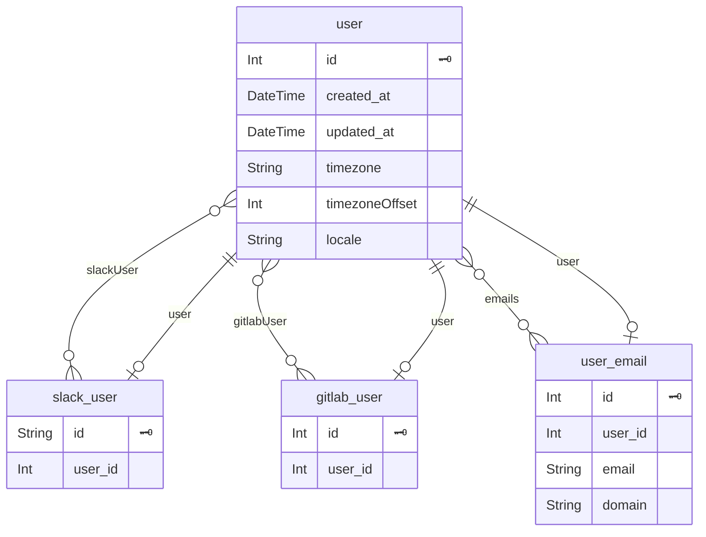

```mermaid
erDiagram

  "user" {
    Int id "🗝️"
    DateTime created_at 
    DateTime updated_at 
    String timezone 
    Int timezoneOffset 
    String locale 
    }
  

  "slack_user" {
    String id "🗝️"
    Int user_id 
    }
  

  "gitlab_user" {
    Int id "🗝️"
    Int user_id 
    }
  

  "user_email" {
    Int id "🗝️"
    Int user_id 
    String email 
    String domain 
    }
  
    "user" o{--}o "slack_user" : "slackUser"
    "user" o{--}o "gitlab_user" : "gitlabUser"
    "user" o{--}o "user_email" : "emails"
    "slack_user" o|--|| "user" : "user"
    "gitlab_user" o|--|| "user" : "user"
    "user_email" o|--|| "user" : "user"
```
